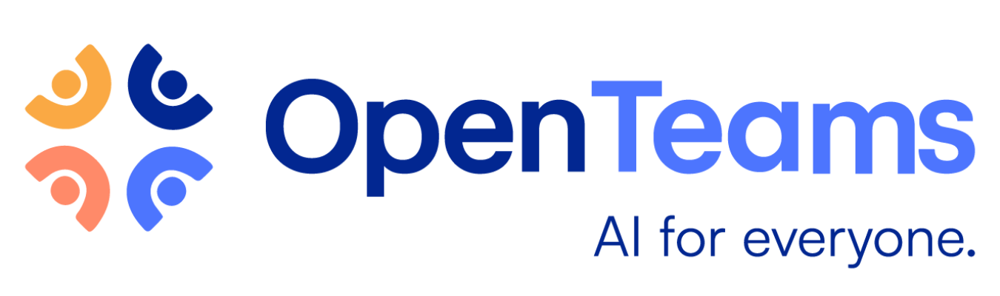

  

---

## 🚀 Christian Lira G.
*Business Analytics • Data Science • Data Engineering • Machine Learning*

📊 Turning raw data into actionable insights | ⚙️ Building end-to-end data & full-stack solutions | 🌍 Globally minded & multilingual

  
  

---

## 📌 Quick Highlights
- 📊 Transforming raw data into **insights** with Business Analytics & Data Science  
- ⚙️ Building **data pipelines, dashboards, and full-stack apps** for real-world impact  
- 🏢 Experience at **Tesla, OpenTeams, Westmark, and BYU–Idaho**  
- 🌍 Multilingual communicator (English, Español, 中文, Deutsch)  

---

## 🏢 Past Work Experiences

Through my academic and professional journey, I’ve had the opportunity to contribute to projects and initiatives at:

<table width="100%">
  <tr>
    <td align="center" width="25%">
       Tesla
    </td>
    <td align="center" width="25%">
       BYU–Idaho
    </td>
    <td align="center" width="25%">
       OpenTeams
    </td>
    <td align="center" width="25%">
       Westmark Credit Union
    </td>
  </tr>
</table>

---

## 🧠 About My Work

At the center of every business decision lies **data**. Surrounding it are the technologies we use to collect, manage, and activate that data. And beyond that, the broader goals of business, finance, and operations that give it all meaning.

My work sits at the intersection of these three layers. Through my projects, I aim to integrate **Data Science**, **Information Technologies**, and **Business Strategy** to build solutions that are insightful, actionable, and aligned with real-world needs.  

Whether I’m creating machine learning models, building dashboards, designing full-stack applications, or analyzing financial performance, I approach each problem with a **systems mindset**.

This GitHub serves as a portfolio of that journey. It’s designed to speak to **Business Leaders**, **Data Scientists**, and **Technical Professionals** alike.  

---

## 🛠️ Tech Stack
- **📊 Business Intelligence** → Tableau, Power BI, Excel & VBA  
- **📈 Data Science & Analytics** → Python, R, Pandas, NumPy, Matplotlib, ggplot2, dplyr, tidyverse  
- **🔐 Data Governance & Engineering** → SQL (PostgreSQL, MySQL), Git, GitHub, DBMS tools  
- **🤖 Machine Learning** → Scikit-learn, TensorFlow  
- **🌐 Full-Stack Development** → HTML, CSS, JavaScript (React), Python (Flask), Node.js, REST APIs, Docker, GitHub Actions  

---

## 🎓 Certifications & Education
- 📜 [List of earned Certificates](https://www.linkedin.com/in/christianlg/details/certifications)  
- 🎓 [Education](https://www.linkedin.com/in/christianlg/details/education)  

---

## ⚡ Fun Facts
- 🌍 Multilingual: English, Spanish (Español), Chinese (中文), German (Deutsch)  
- 🎓 Dual background in **Analytics & Political Science**  
- 📚 Passionate about literature, philosophy, and economics — exploring human behavior and decision-making  
- 🤖 Robotics tinkerer & gamer on the side  

---

## 📊 GitHub Stats

  
  

---

💡 *I’m passionate about connecting data, technology, and strategy to solve problems.*  
📬 Let’s connect → [LinkedIn](https://www.linkedin.com/in/christianlg/) | [Portfolio](https://www.cirago.com) | [Email](mailto:lir18001@byui.edu)

<!--
**ChristianLG2/ChristianLG2** is a ✨ _special_ ✨ repository because its `README.md` (this file) appears on your GitHub profile.

Here are some ideas to get you started:

- 🔭 I’m currently working on ...
- 🌱 I’m currently learning ...
- 👯 I’m looking to collaborate on ...
- 🤔 I’m looking for help with ...
- 💬 Ask me about ...
- 📫 How to reach me: ...
- 😄 Pronouns: ...
- ⚡ Fun fact: ...
-->
