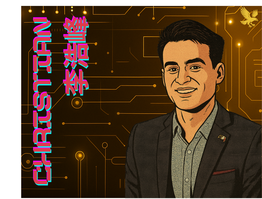

  <h1>Hi, I am Christian Lira G.<h1>

  

  
  

  

  
  

<h3>⚠️ Repository Under Maintenance</h3>

Thank you for visiting my GitHub! I'm currently restructuring and updating my repositories to better showcase my projects across Data Science, Business Intelligence, Data Engineering, and Web Development.

You may notice that:
- Some files or subfolders are temporarily missing  
- Certain GitHub Pages may not be working as expected  
- Repository names or contents might change over the next few days  

🎯 **Why?**  
I’m organizing my work for clarity, professional presentation, and future portfolio expansion.

If you’re looking for a specific file, dataset, or project that appears missing, feel free to open an issue or contact me directly.

Thanks for your patience while everything gets a proper refresh! 🙌

<h3>🧠 About My Work</h3>

At the center of every business decision lies data. Surrounding it are the technologies we use to collect, manage, and activate that data. And beyond that, the broader goals of business, finance, and operations that give it all meaning.

My work sits at the intersection of these three layers. Through my projects, I aim to integrate **Data Science**, **Information Technologies**, and **Business Strategy** to build solutions that are insightful, actionable, and aligned with real-world needs. Whether I’m creating machine learning models, building dashboards, designing full-stack applications, or analyzing financial performance, I approach each problem with a systems mindset.

This GitHub serves as a portfolio of that journey, where I apply a wide variety of tools across different layers of a business to solve problems and create impact across fields.. It’s designed to speak to **Business Leaders**, **Data Scientists**, and **Technical Professionals** alike—anyone who believes that decisions should be backed by insight, and insight by well-structured data and systems.

**Feel free to explore the repos, check out the dashboards, or connect with me if you'd like to collaborate.**

<h3>🎓 Professional Certifications and Achievements:</h3>
<ul>
   <li><a href="https://www.linkedin.com/in/christianlg/details/certifications" target="_blank" rel="noopener noreferrer"> List of earned Certificates </a></li>
   <li><a href="https://www.linkedin.com/in/christianlg/details/education" target="_blank" rel="noopener noreferrer"> Education </a></li>
</ul>

<h3>🛠️ Tech Stack</h3>

<strong>📊 Business Intelligence:</strong> Tableau, Power BI, Excel & VBA

<strong>📈 Data Science & Analytics:</strong> Python, R, Pandas, NumPy, Matplotlib, ggplot2, dplyr, tidyverse

<strong>🔐 Data Governance & Engineering:</strong> SQL (PostgreSQL, MySQL), Git, GitHub, DBMS tools

<strong>🤖 Machine Learning:</strong> Scikit-learn, TensorFlow 

<strong>🌐 Full-Stack Development:</strong> HTML, CSS, JavaScript (React), Python (Flask), Node.js, MySQL, SQLite, REST APIs, Docker, GitHub Actions

<h3>⚡ Fun facts:</h3>
<ul>
  <li>I’m multilingual: fluent in English, Spanish (Español), Chinese (中文), and conversational in German (Deutsch).</li>
  <li>I pursued a second academic minor in Political Science, complementing my technical and analytical studies.</li>
  <li>In my free time, I enjoy reading works in literature, philosophy, and economics, which deepen my understanding of human behavior, systems, and decision-making.</li>
</ul>

<!--
**ChristianLG2/ChristianLG2** is a ✨ _special_ ✨ repository because its `README.md` (this file) appears on your GitHub profile.

Here are some ideas to get you started:

- 🔭 I’m currently working on ...
- 🌱 I’m currently learning ...
- 👯 I’m looking to collaborate on ...
- 🤔 I’m looking for help with ...
- 💬 Ask me about ...
- 📫 How to reach me: ...
- 😄 Pronouns: ...
- ⚡ Fun fact: ...
-->
